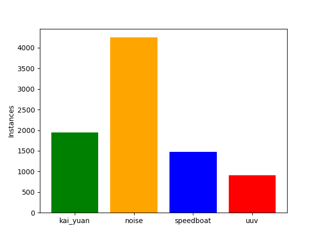
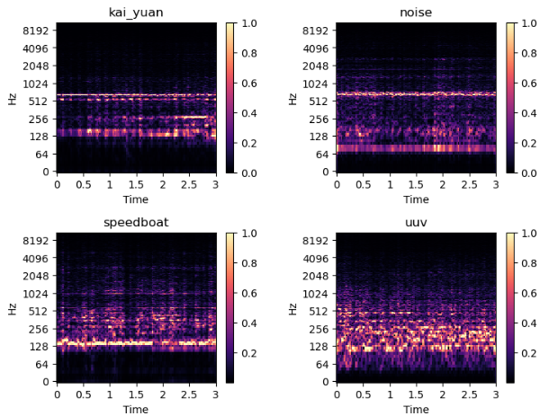
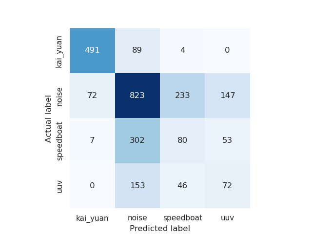
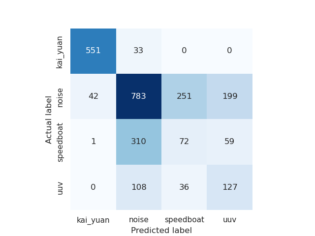

## Ship Classification 
This project aims to distinguish between different types of ships using their noise radiated from the ship using ML models. Two models Convolutional Neural Network and Vision Transformer (ViT) is trained to learn the different ship types and classify them. 

### Dataset 
The QiandaoEar22 (https://ieee-dataport.org/documents/qiandaoear22) dataset is used to train the ML models. The dataset contains 9 hours and 28 minutes of real-world ship-radiated noise data and 21 hours and 58 minutes of background noise data. The data is downloaded and organised in the following file structure:
Sounds/

├── kai_yuan/

│   └── target/.wav files

├── noise/

│   └── target/.wav files

├── speedboat/

│   └── target/.wav files

└── uuv/

    └── target/.wav files

There are three kinds of ships: kai-yuan, speedboat and uuv, and the rest of the samples are noise. 
Thier distribution is: 



### Feature Engineering 
Now audio files need to be converted into arrays so that ML models can be trained on it. Audio can be analyzed using specttrograms, which are visual plots of the frequency variation with time. 
It is calculated by performing Short Time Fourier Transform(STFT) on the audio wave. 
For this we use a python library called librosa. The x axis represents time and y axis is the frequency in log scale and the amplitude of the frequency gives the color of the figure.
Examples of one spectrogram figure is shown below:



The script spectogram.py converts the wav files into spectrograms. 
```python
def create_spectrogram_from_audio(audio_file: str, image_file: str) -> None:
    fig = plt.figure(figsize=(10, 10))
    ax = fig.add_subplot(1, 1, 1)
    fig.subplots_adjust(left=0, right=1, bottom=0, top=1)
    y, sr = librosa.load(audio_file)
    y = librosa.util.normalize(y)
    st = abs(librosa.stft(y))
    st = librosa.util.normalize(st)

    librosa.display.specshow(st, sr=sr, y_axis='log')
    fig.savefig(image_file)
```
Since it is a very expensive process, the task is split into available threads to speed it up.
After creating spectrograms, the data from the image needs to be converted into arrays, and should be assigned labels. The script pre_process.py does that. The labels are one hot encoded to make it easy for the ML models to learn from it. The data is split into training and testing sets and stored. 

### Models 

#### CNN model
The first model implemented is a Convolutional Neural Network. The model architecture is as follows:
```python
model = tf.keras.models.Sequential()
model.add(tf.keras.layers.Input(shape=(75, 75, 3)))
model.add(tf.keras.layers.Conv2D(32, 3, strides=2, padding='same', activation='relu'))
model.add(tf.keras.layers.BatchNormalization())
model.add(tf.keras.layers.MaxPooling2D(pool_size=(2, 2)))
model.add(tf.keras.layers.Conv2D(32, 3, padding='same', activation='relu'))
model.add(tf.keras.layers.MaxPooling2D(pool_size=(2, 2)))
model.add(tf.keras.layers.Flatten())
model.add(tf.keras.layers.Dense(256, activation='relu'))
model.add(tf.keras.layers.Dropout(0.5))
model.add(tf.keras.layers.Activation('linear', dtype='float16'))
model.add(tf.keras.layers.Dense(N_CLASSES, activation='softmax'))
model.compile(loss='categorical_crossentropy', optimizer=tf.keras.optimizers.RMSprop(), metrics=['accuracy'])
```

Two convolutional layers of 32 filters, each followed by a Max Pooling layer. The output of the convolutional layers is flattened and sent to a densely connected neural layer and goes into output layer. Root Mean Square Propagation optimizer is used to minimize the categorical cross entropy loss. 

#### Transformer model
The second model used is the Vision Transformer layer. The idea behind this architecture is to split the images into many patches and to pass these patches with positional embeddings is fed into a transformer encoder. The implementaion of the Visual transformer model is taken from this Keras tutorial: https://keras.io/examples/vision/image_classification_with_vision_transformer/

### Evaluation 
The performance of the models are studied using a confusion matrix. First the confusion matrix of the CNN model: 



We see that most of the Kai Yuan ships are classified correctly. However most of the speedboats and UUV boats are getting classified as noise. 

The confusion matrix of the transformer model is shown below:



The transformer model is better than CNN model as we can see the more of the ship labels are classified correctly than the CNN model. However the Speedboats are still getting misclassified as noise. 

Overall both models have struggled to separate the ship sounds from noise, but the Visual transformer model has performed better than the Convolutional model
